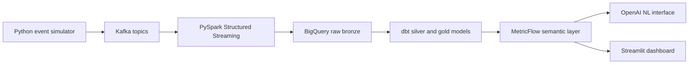

# Growth Analytics Platform

Warehouse-first growth analytics for multi-touch attribution, funnel and cohort analysis, and governed natural-language metric discovery.

## What This Is

Growth Analytics Platform is a portfolio-grade data engineering project that will simulate ad-to-conversion user journeys and turn them into trustworthy growth metrics. The finished system is designed around a modern warehouse-first stack:

Python simulator -> Kafka -> PySpark Structured Streaming -> BigQuery -> dbt Core + MetricFlow -> OpenAI-powered data discovery -> Streamlit dashboard.

This repository is currently in Phase 0: project scaffolding only. Business logic, dbt models, streaming jobs, and dashboard features will be added in later phases.

## Architecture



## Quick Start

```bash
make setup
cp .env.example .env
```

Later phases will fill in the runnable commands for simulation, streaming, dbt, and the dashboard.

## Project Structure

```text
growth-analytics-platform/
├── simulator/
├── streaming/
├── dbt_project/
├── nl_interface/
├── dashboard/
├── infra/
└── docs/
```
