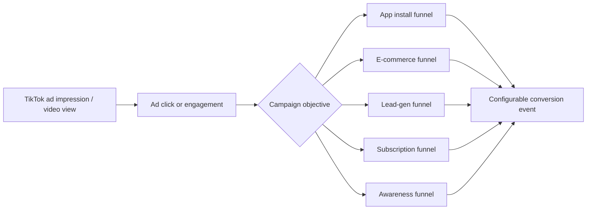
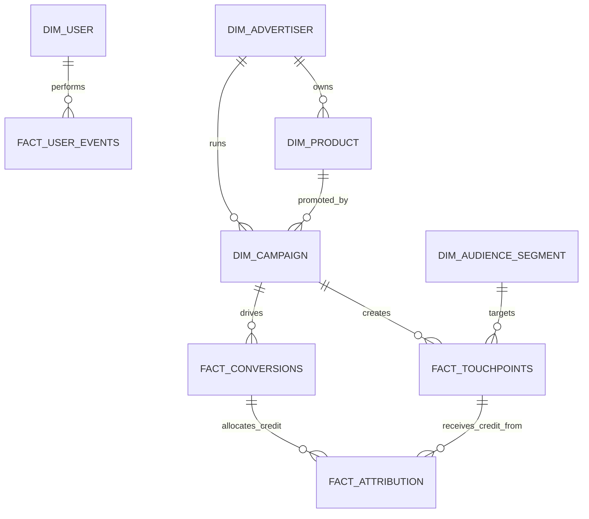

# TikTok Ads Growth Analytics Platform Data Model

This document is the contract for the Growth Analytics Platform. The project is now framed as a configurable TikTok Ads data platform that supports many advertiser/product objectives, not a single hard-coded app funnel.

Implementation baseline: Python 3.13+ for simulator, streaming, orchestration helpers, and later application code.

The platform answers questions like:

- Which TikTok campaigns drive the highest-quality conversions for each advertiser objective?
- How do attribution models change campaign, creative, audience, and product performance?
- Which audience segments and targeting tags convert, retain, or monetize best?
- Can business users discover governed metrics through a semantic layer and LLM without inventing SQL?

## Product Scope

The platform models ads running on TikTok for multiple advertiser archetypes:

| Objective | Example advertisers | Primary conversion | Funnel shape |
|---|---|---|---|
| `app_install` | mobile games, fintech apps, shopping apps | install, signup, activation, purchase | ad -> click -> app install -> signup -> activation -> purchase |
| `ecommerce_purchase` | TikTok Shop sellers, beauty, fashion, gadgets | purchase | ad/video -> product view -> add to cart -> checkout -> purchase |
| `lead_generation` | education, insurance, real estate, B2B SaaS | lead submit or qualified lead | ad -> landing page -> form start -> lead submit -> qualified lead |
| `subscription` | fitness, music, learning, meditation apps | paid subscription or renewal | ad -> signup/install -> trial -> subscription -> renewal |
| `marketplace_order` | delivery, travel, local services | order or booking | ad -> signup -> search/browse -> first order -> repeat order |
| `brand_awareness` | CPG, entertainment launches, retail brands | engaged view or site visit | impression -> video view -> engagement -> profile/site visit |
| `offline_conversion` | restaurants, events, clinics, gyms | call, booking, store visit | ad -> click/call/directions -> booking/store visit |

The same warehouse, identity, attribution, quality, and semantic metric layers support every objective. Objective-specific behavior lives in configurable dimensions and funnel templates.



## Design Principles

- Model advertiser objectives explicitly; never assume every campaign has install, signup, and purchase.
- Keep raw events immutable in bronze and add business interpretation in silver and gold.
- Resolve identity deterministically for portfolio scope while preserving anonymous users.
- Separate `event_type`, `funnel_step`, and `conversion_event`. The same event can be a funnel step for one objective and a conversion for another.
- Attribute conversions to eligible touchpoints within a 30-day lookback window, with model choice exposed.
- Put governed metrics in MetricFlow so analysts, dashboards, and LLM agents share one source of truth.

## Event Taxonomy

All events use a common flat envelope so Kafka, Spark, BigQuery, and dbt can process every objective consistently.

### Common Event Envelope

| Column | Type | Required | Description |
|---|---:|---:|---|
| `event_id` | STRING | Yes | Globally unique event identifier. |
| `event_type` | STRING | Yes | Event name from this taxonomy. |
| `event_timestamp` | TIMESTAMP | Yes | UTC event time. |
| `event_date` | DATE | Yes | UTC date derived from event time. |
| `schema_version` | INT64 | Yes | Starts at `1`; increments on backward-incompatible event changes. |
| `advertiser_id` | STRING | Yes | Advertiser or business running the campaign. |
| `product_id` | STRING | Yes | Product, app, service, or offer being promoted. |
| `campaign_id` | STRING | Yes | Campaign identifier. |
| `ad_group_id` | STRING | No | Ad group or line item identifier. |
| `creative_id` | STRING | No | Creative or video identifier. |
| `objective` | STRING | Yes | Campaign objective, for example `app_install` or `ecommerce_purchase`. |
| `channel` | STRING | Yes | Usually `tiktok_ads`; comparison channels include `meta_ads`, `google_ads`, `email`, `organic`, `referral`. |
| `device_id` | STRING | Yes | Anonymous device/browser identifier. |
| `user_id` | STRING | No | Advertiser-side user/customer id when known. |
| `session_id` | STRING | No | Session identifier where applicable. |
| `audience_segment_id` | STRING | No | Audience package, cohort, or segment used for targeting. |
| `targeting_tag_ids` | STRING | No | Pipe-delimited targeting tags applied at serving time. |
| `country` | STRING | Yes | ISO country code. |
| `region` | STRING | No | State, province, or market. |
| `city` | STRING | No | City. |
| `device_type` | STRING | Yes | `ios`, `android`, `web`, or `desktop`. |
| `platform` | STRING | Yes | `tiktok`, `mobile_app`, `mobile_web`, `desktop_web`, `offline`, or partner platform. |
| `ingest_source` | STRING | Yes | Source system, initially `simulator`. |

### Touchpoint and Engagement Events

| Event | When fired | Key attributes |
|---|---|---|
| `ad_impression` | An ad is served or displayed. | `impression_id`, `placement`, `bid_type`, `cost_micros`, `is_viewable`. |
| `video_view` | A promoted video is watched. | `view_id`, `watch_seconds`, `video_duration_seconds`, `view_percent`, `is_engaged_view`. |
| `ad_click` | A user clicks a CTA, product link, app link, lead form, or website link. | `click_id`, `impression_id`, `destination_url`, `click_type`, `cost_micros`. |
| `engagement` | User likes, comments, shares, follows, saves, or visits profile. | `engagement_id`, `engagement_type`, `content_id`, `is_key_engagement`. |
| `landing_page_view` | External web or app landing page loads. | `page_view_id`, `url`, `referrer`, `load_time_ms`. |

### App and Account Events

| Event | When fired | Key attributes |
|---|---|---|
| `app_install` | Mobile app is installed or first opened. | `install_id`, `app_version`, `os_version`, `attributed_click_id`, `install_source`. |
| `signup` | User creates an account. | `signup_id`, `signup_method`, `marketing_opt_in`, `referral_code`. |
| `activation` | User completes an objective-specific key action. | `activation_id`, `activation_event_name`, `activation_value`, `hours_since_signup`. |

Activation is objective-specific:

| Objective | Activation definition |
|---|---|
| `app_install` | Completes first meaningful in-app action, for example level 3, first transfer, or first search. |
| `ecommerce_purchase` | Views 3 products or adds first item to cart within 24 hours. |
| `subscription` | Starts trial or completes first core session. |
| `marketplace_order` | Searches/browses and saves or selects an item/service. |
| `lead_generation` | Starts lead form or reaches pricing/contact page. |

### Commerce, Lead, Subscription, and Offline Events

| Event | When fired | Key attributes |
|---|---|---|
| `product_view` | Product detail page or shoppable card is viewed. | `product_sku`, `category`, `price`, `view_source`. |
| `add_to_cart` | Item is added to cart. | `cart_id`, `product_sku`, `quantity`, `item_value`. |
| `checkout_started` | User begins checkout. | `checkout_id`, `cart_id`, `cart_value`, `currency`. |
| `purchase` | User completes a revenue event. | `purchase_id`, `conversion_id`, `order_id`, `purchase_type`, `revenue`, `currency`, `product_sku`. |
| `form_start` | Lead form is opened or started. | `form_id`, `lead_type`, `landing_page_id`. |
| `lead_submit` | User submits lead information. | `lead_id`, `lead_type`, `lead_value`, `form_id`. |
| `qualified_lead` | Lead is scored or accepted as qualified. | `lead_id`, `qualification_score`, `qualified_value`, `qualified_at`. |
| `trial_started` | Trial begins for a subscription product. | `trial_id`, `plan_id`, `trial_length_days`. |
| `subscription_started` | User becomes a paid subscriber. | `subscription_id`, `plan_id`, `revenue`, `billing_period`, `currency`. |
| `renewal` | Subscription renews. | `subscription_id`, `renewal_number`, `revenue`, `currency`. |
| `search_or_browse` | User searches or browses inventory in a marketplace. | `query`, `category`, `result_count`. |
| `booking_or_order` | Marketplace order, reservation, ride, delivery, or booking completes. | `order_id`, `booking_type`, `revenue`, `currency`. |
| `call_or_directions` | Offline/local CTA is used. | `cta_id`, `cta_type`, `business_location_id`. |
| `offline_conversion` | Store visit, appointment, or offline sale is matched back. | `offline_conversion_id`, `conversion_type`, `revenue`, `match_confidence`. |

## Configurable Objective and Funnel Model

The platform supports multiple funnels through configuration tables instead of hard-coded SQL branches.

### `funnel_template`

| Column | Type | Description |
|---|---:|---|
| `funnel_template_id` | STRING | Primary key. |
| `objective` | STRING | Campaign objective this template supports. |
| `template_name` | STRING | Human-readable funnel name. |
| `primary_conversion_event_type` | STRING | Default conversion event for this objective. |
| `conversion_value_column` | STRING | Column used as value, for example `revenue` or `lead_value`. |
| `is_revenue_objective` | BOOL | True when conversion value is direct revenue. |

### `funnel_step_definition`

| Column | Type | Description |
|---|---:|---|
| `funnel_template_id` | STRING | Template id. |
| `step_number` | INT64 | Ordered step position. |
| `step_name` | STRING | Canonical step name. |
| `event_type` | STRING | Event type completing the step. |
| `required` | BOOL | Whether the step is required for canonical funnel completion. |
| `max_days_from_prior_step` | INT64 | Optional step window. |

### Default Funnel Templates

| Objective | Steps |
|---|---|
| `app_install` | `ad_impression -> ad_click -> app_install -> signup -> activation -> purchase -> repeat_purchase` |
| `ecommerce_purchase` | `ad_impression -> video_view/ad_click -> product_view -> add_to_cart -> checkout_started -> purchase -> repeat_purchase` |
| `lead_generation` | `ad_impression -> ad_click -> landing_page_view -> form_start -> lead_submit -> qualified_lead` |
| `subscription` | `ad_impression -> ad_click -> signup/app_install -> trial_started -> subscription_started -> renewal` |
| `marketplace_order` | `ad_impression -> ad_click -> signup -> search_or_browse -> booking_or_order -> repeat_order` |
| `brand_awareness` | `ad_impression -> video_view -> engagement -> profile_visit/site_visit` |
| `offline_conversion` | `ad_impression -> ad_click -> call_or_directions -> offline_conversion` |

### `conversion_definition`

| Column | Type | Description |
|---|---:|---|
| `conversion_definition_id` | STRING | Primary key. |
| `objective` | STRING | Objective. |
| `conversion_event_type` | STRING | Event considered a conversion. |
| `conversion_name` | STRING | Business-friendly name. |
| `value_type` | STRING | `revenue`, `lead_value`, `estimated_value`, or `count`. |
| `lookback_days` | INT64 | Attribution lookback window, default 30. |
| `dedupe_scope` | STRING | `event`, `user_day`, `user_campaign`, or `order`. |

## Identity Model

Identity must work for app, web, lead, commerce, and offline paths. The project uses deterministic stitching only.

```text
resolved_user_id = coalesce(
  user_id,
  customer_id,
  device_to_user.user_id,
  lead_to_user.user_id,
  concat('anon_', device_id)
)
```

Rules:

1. Build `device_to_user` from signup, install, lead, purchase, and subscription events that include both `device_id` and `user_id`.
2. Map pre-conversion touchpoints to later known users when the same device appears.
3. Keep anonymous users as `anon_<device_id>` if no deterministic match exists.
4. Preserve `match_method` and `identity_confidence`; deterministic matches are `1.0`.
5. For shared devices, use event-level `user_id` when present and flag ambiguous pre-signup events.

Future work: probabilistic identity, clean-room joins, hashed email matching, household graphs, and privacy-preserving cross-device models.

## Audience and Targeting Model

This adds the Ads Core signal from the job description: audience definitions, hierarchy, refresh strategy, governance, and data quality.

### `dim_audience_segment`

| Column | Type | Description |
|---|---:|---|
| `audience_segment_id` | STRING | Primary key. |
| `segment_name` | STRING | Human-readable segment name. |
| `segment_type` | STRING | `interest`, `behavior`, `lookalike`, `retargeting`, `custom`, or `broad`. |
| `parent_segment_id` | STRING | Hierarchy parent. |
| `definition_sql_or_rule` | STRING | Governed segment rule. |
| `refresh_cadence` | STRING | `hourly`, `daily`, `weekly`, or `static`. |
| `owner` | STRING | Business or data owner. |
| `is_active` | BOOL | Active flag. |

### `dim_targeting_tag`

| Column | Type | Description |
|---|---:|---|
| `targeting_tag_id` | STRING | Primary key. |
| `tag_name` | STRING | Tag name. |
| `tag_category` | STRING | `geo`, `device`, `language`, `interest`, `behavior`, `purchase_intent`, or `lifecycle`. |
| `definition` | STRING | Governed definition. |
| `last_refreshed_at` | TIMESTAMP | Last successful refresh. |
| `sla_hours` | INT64 | Freshness SLA. |
| `contains_sensitive_data` | BOOL | Privacy flag. |

## Bronze Raw Schema

Bronze tables live in BigQuery dataset `growth_raw`. They are append-only, partitioned by `event_date`, and retain Kafka metadata plus the raw JSON payload.

All bronze tables include: event columns, `ingested_at`, `kafka_topic`, `kafka_partition`, `kafka_offset`, and `raw_payload`.

| Table | Kafka topic | Partition | Clustering |
|---|---|---|---|
| `bronze_ad_impressions` | `ad_impressions` | `event_date` | `advertiser_id`, `campaign_id`, `device_id` |
| `bronze_video_views` | `video_views` | `event_date` | `advertiser_id`, `campaign_id`, `device_id` |
| `bronze_ad_clicks` | `ad_clicks` | `event_date` | `advertiser_id`, `campaign_id`, `device_id` |
| `bronze_landing_page_views` | `landing_page_views` | `event_date` | `advertiser_id`, `campaign_id`, `device_id` |
| `bronze_app_installs` | `app_installs` | `event_date` | `advertiser_id`, `product_id`, `device_id` |
| `bronze_signups` | `signups` | `event_date` | `advertiser_id`, `user_id`, `device_id` |
| `bronze_activations` | `activations` | `event_date` | `advertiser_id`, `user_id` |
| `bronze_commerce_events` | `commerce_events` | `event_date` | `advertiser_id`, `product_id`, `user_id` |
| `bronze_lead_events` | `lead_events` | `event_date` | `advertiser_id`, `campaign_id`, `lead_id` |
| `bronze_subscription_events` | `subscription_events` | `event_date` | `advertiser_id`, `user_id` |
| `bronze_marketplace_events` | `marketplace_events` | `event_date` | `advertiser_id`, `user_id` |
| `bronze_offline_conversions` | `offline_conversions` | `event_date` | `advertiser_id`, `offline_conversion_id` |
| `device_to_user` | `identity_events` | `event_date` | `device_id`, `user_id` |

## Silver Schema

### `events_unified`

One row per event across all objectives.

| Column | Type | Description |
|---|---:|---|
| `event_id` | STRING | Unique event id. |
| `event_type` | STRING | Event discriminator. |
| `objective` | STRING | Campaign objective. |
| `event_timestamp` | TIMESTAMP | UTC event time. |
| `event_date` | DATE | UTC event date. |
| `advertiser_id` | STRING | Advertiser id. |
| `product_id` | STRING | Product/offer id. |
| `campaign_id` | STRING | Campaign id. |
| `ad_group_id` | STRING | Ad group id. |
| `creative_id` | STRING | Creative id. |
| `audience_segment_id` | STRING | Audience segment. |
| `targeting_tag_ids` | STRING | Pipe-delimited tag ids. |
| `device_id` | STRING | Device id. |
| `user_id` | STRING | Known user id when present. |
| `resolved_user_id` | STRING | Deterministically stitched analytical id. |
| `session_id` | STRING | Session id. |
| `channel` | STRING | Channel. |
| `country` | STRING | Country. |
| `device_type` | STRING | Device type. |
| `touchpoint_id` | STRING | Impression, view, click, or engagement id if applicable. |
| `conversion_id` | STRING | Conversion id when applicable. |
| `event_value` | NUMERIC | Revenue, lead value, estimated value, or null. |
| `currency` | STRING | Currency. |
| `event_properties` | JSON | Event-specific properties. |
| `source_table` | STRING | Bronze source table. |
| `ingested_at` | TIMESTAMP | Ingestion time. |

Deduplication key: `event_id`; keep the latest `ingested_at`.

### `sessions`

One row per resolved user session using a 30-minute inactivity window. Sessions support web/app funnels and are optional for offline conversions.

## Gold Dimensional Model



### Dimensions

| Dimension | Grain | Key fields |
|---|---|---|
| `dim_advertiser` | one row per advertiser | `advertiser_id`, `advertiser_name`, `industry`, `country`, `account_tier`, `business_type`. |
| `dim_product` | one row per promoted product/app/offer | `product_id`, `advertiser_id`, `product_name`, `product_category`, `objective_default`, `price_point`, `is_app`, `is_subscription`. |
| `dim_campaign` | one row per campaign | `campaign_id`, `advertiser_id`, `product_id`, `objective`, `campaign_name`, `start_date`, `end_date`, `daily_budget`, `bid_strategy`, `optimization_goal`. |
| `dim_channel` | one row per channel | `channel`, `channel_group`, `is_paid`, `default_attribution_role`. |
| `dim_audience_segment` | one row per segment | Segment hierarchy, definition, owner, refresh cadence. |
| `dim_targeting_tag` | one row per targeting tag | Tag category, governed definition, freshness SLA, privacy flag. |
| `dim_user` | one row per resolved user | `resolved_user_id`, first seen, signup date, country, device type, lifecycle stage, LTV to date. |
| `dim_date` | one row per date | Day, week, month, quarter, year, day of week, weekend flag. |

### Facts

#### `fact_touchpoints`

One row per eligible ad or engagement touchpoint.

Key columns: `touchpoint_id`, `event_id`, `touchpoint_type`, `advertiser_id`, `product_id`, `campaign_id`, `creative_id`, `audience_segment_id`, `resolved_user_id`, `device_id`, `channel`, `touchpoint_timestamp`, `cost_micros`, `is_paid_touchpoint`, `touchpoint_position_user`.

Touchpoint types include `ad_impression`, `video_view`, `ad_click`, and paid/owned `engagement`.

#### `fact_conversions`

One row per configured conversion event, not just purchases.

Key columns: `conversion_id`, `conversion_definition_id`, `event_id`, `objective`, `conversion_event_type`, `advertiser_id`, `product_id`, `campaign_id`, `resolved_user_id`, `conversion_timestamp`, `conversion_date`, `conversion_value`, `currency`, `is_revenue_conversion`, `dedupe_key`, `eligible_touchpoint_count_30d`.

Examples:

- `purchase` for e-commerce.
- `app_install`, `signup`, `activation`, or `purchase` for app campaigns.
- `lead_submit` or `qualified_lead` for lead-gen.
- `subscription_started` or `renewal` for subscription.
- `booking_or_order` for marketplace.
- `engaged_view` or `site_visit` for awareness.

#### `fact_user_events`

One row per event for funnel, cohort, and behavioral analysis.

Key columns: `event_id`, `event_type`, `objective`, `advertiser_id`, `product_id`, `campaign_id`, `resolved_user_id`, `session_sk`, `event_timestamp`, `event_date`, `funnel_template_id`, `funnel_step`, `event_value`, `is_key_engagement`.

#### `fact_funnel_step_completion`

One row per user, campaign/objective, and funnel step.

Key columns: `resolved_user_id`, `advertiser_id`, `campaign_id`, `objective`, `funnel_template_id`, `step_number`, `step_name`, `completed_at`, `completed_flag`.

#### `fact_audience_profile_daily`

One row per audience segment/tag/date for targeting quality.

Key columns: `date_day`, `audience_segment_id`, `targeting_tag_id`, `profile_count`, `eligible_user_count`, `matched_user_count`, `refresh_completed_at`, `freshness_hours`, `quality_status`.

## Attribution Model Design

Attribution applies to `fact_conversions` using eligible `fact_touchpoints` before conversion and within the conversion definition's lookback window, default 30 days. For each conversion, credit fractions must sum to `1.0`.

If a conversion has no eligible touchpoints, assign it to `unattributed` with `credit_fraction = 1.0`.

Shared output schema:

| Column | Type | Description |
|---|---:|---|
| `conversion_id` | STRING | Conversion id. |
| `conversion_definition_id` | STRING | Conversion definition. |
| `objective` | STRING | Campaign objective. |
| `resolved_user_id` | STRING | Analytical user id. |
| `touchpoint_id` | STRING | Eligible touchpoint id or `unattributed`. |
| `advertiser_id` | STRING | Advertiser. |
| `product_id` | STRING | Product. |
| `campaign_id` | STRING | Campaign. |
| `creative_id` | STRING | Creative. |
| `audience_segment_id` | STRING | Audience segment. |
| `channel` | STRING | Channel. |
| `credit_fraction` | FLOAT64 | Fraction of conversion credit. |
| `attributed_value` | NUMERIC | `credit_fraction * conversion_value`. |
| `attribution_model` | STRING | Model name. |

### Five Attribution Models

Worked example: a `$100` e-commerce purchase has three prior touchpoints:

1. Day 0: TikTok ad impression.
2. Day 2: TikTok video view.
3. Day 6: TikTok product click.
4. Day 7: Purchase.

| Model | Impression | Video view | Product click | Rule |
|---|---:|---:|---:|---|
| First-touch | 100%, $100.00 | 0%, $0.00 | 0%, $0.00 | Earliest eligible touchpoint gets all credit. |
| Last-touch | 0%, $0.00 | 0%, $0.00 | 100%, $100.00 | Latest eligible touchpoint gets all credit. |
| Linear | 33.33%, $33.33 | 33.33%, $33.33 | 33.33%, $33.33 | Equal split. |
| Time-decay | 20.60%, $20.60 | 25.17%, $25.17 | 54.23%, $54.23 | Exponential decay with 7-day half-life. |
| Position-based | 40%, $40.00 | 20%, $20.00 | 40%, $40.00 | First 40%, last 40%, middle split 20%. |

Time-decay:

```text
raw_weight = pow(0.5, days_before_conversion / 7.0)
credit_fraction = raw_weight / sum(raw_weight)
```

Position-based edge cases:

- 1 touchpoint: 100%.
- 2 touchpoints: 50% / 50%.
- 3 or more touchpoints: 40% first, 40% last, remaining 20% split across middle touches.

## Cohort and Retention Design

Cohorts depend on objective:

| Objective | Cohort anchor | Retention event |
|---|---|---|
| `app_install` | install date or signup date | activation, engagement, purchase. |
| `ecommerce_purchase` | first purchase date | repeat purchase or product engagement. |
| `lead_generation` | lead submit date | qualified lead, sales accepted lead, closed deal. |
| `subscription` | trial start or subscription start date | renewal or active subscription. |
| `marketplace_order` | first order date | repeat order or search/browse. |
| `brand_awareness` | first engaged view date | repeat engagement or site/profile visit. |

Default reporting uses weekly cohorts. Day-level D1, D7, and D30 retention are available for app and subscription objectives.

## Metrics Catalog

MetricFlow will define governed metrics by objective.

| Metric | Definition | Applies to |
|---|---|---|
| `impressions` | Count of ad impressions. | all objectives |
| `engaged_views` | Count of video views meeting engaged-view threshold. | awareness, commerce |
| `clicks` | Count of ad clicks. | all objectives |
| `ctr` | clicks / impressions. | all objectives |
| `spend` | Sum of media spend. | paid campaigns |
| `conversions_<objective>` | Count configured conversions for objective. | all objectives |
| `conversion_rate_<objective>` | conversions / relevant prior funnel step. | all objectives |
| `attributed_value_<model>` | Sum conversion value credited by attribution model. | all objectives |
| `roas_<model>` | attributed revenue / spend. | revenue objectives |
| `cac_<model>` | spend / attributed new customers. | app, commerce, subscription, marketplace |
| `cpi` | spend / installs. | app install |
| `cpl` | spend / submitted leads. | lead generation |
| `cpql` | spend / qualified leads. | lead generation |
| `aov` | purchase revenue / purchase count. | commerce, marketplace |
| `add_to_cart_rate` | add-to-cart users / product-view users. | commerce |
| `checkout_conversion_rate` | purchases / checkout starts. | commerce |
| `trial_to_paid_rate` | paid subscriptions / trials. | subscription |
| `renewal_rate` | renewals / subscriptions due for renewal. | subscription |
| `dau`, `wau`, `mau` | Distinct active resolved users by day/week/month. | app, marketplace, subscription |
| `d1_retention`, `d7_retention`, `d30_retention` | Retained users / cohort size. | app, subscription |
| `repeat_purchase_rate` | repeat purchasers / first purchasers. | commerce, marketplace |
| `ltv_to_date` | Sum revenue by resolved user to date. | revenue objectives |
| `ltv_to_cac_ratio` | average LTV / CAC. | revenue objectives |
| `audience_match_rate` | matched users / eligible users. | targeting |
| `tag_freshness_sla_rate` | tags refreshed within SLA / total active tags. | targeting |

Metric caveats:

- Conversion means different things by objective; the semantic layer must expose objective filters and definitions.
- ROAS is only meaningful for revenue-valued conversions.
- Lead value may be estimated until closed-loop sales data arrives.
- Awareness metrics should not be compared directly to purchase ROAS.
- CAC depends on attribution model and conversion definition.

## Data Quality Contracts

Minimum tests required later:

- `event_id` is unique after staging deduplication.
- `advertiser_id`, `product_id`, `campaign_id`, `objective`, and `event_type` are not null in `events_unified`.
- Every campaign has a valid objective and funnel template.
- Every configured conversion event maps to one `conversion_definition`.
- Every attributed conversion has credit fractions summing to `1.0`.
- Conversion timestamps are after eligible touchpoints.
- Funnel step timestamps do not move backward within a completed funnel.
- Revenue and spend are non-negative.
- Audience tags have owner, definition, refresh timestamp, and SLA status.
- Source freshness tests warn when bronze tables stop receiving data.

## Future Extensions

- Privacy-preserving identity resolution and clean-room attribution.
- Low-latency audience profile serving and tag query APIs.
- Automated backfill and repair workflows for stale audience tags.
- Experiment holdouts and incrementality measurement.
- Real ad platform cost ingestion instead of seeded spend.
- Predictive LTV and budget optimization.
